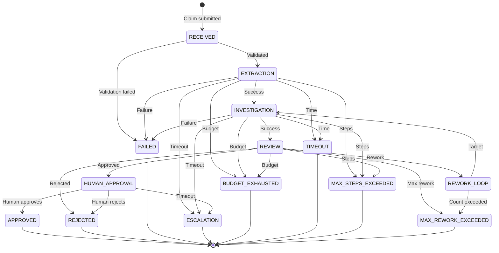

# CASEFILE State Machine Design

## Implementation Status (Phase 10)

Every accepted transition emits a `casefile.workflow.transition` span
(source/destination/trigger/actor/sequence/duration) and supervisor
routing emits `casefile.supervisor.route`; audit events remain the
durable source of truth while spans are diagnostic-only.

## Implementation Status (Phase 9)

`HUMAN_APPROVAL` waits are now backed by durable versioned approval
requests: the supervisor parks (no automatic transition), explicit
human decisions drive `APPROVAL_GRANTED`/`APPROVAL_REJECTED` (expiry via
`APPROVAL_TIMED_OUT`), and terminal states reject new requests and
decisions alike. Cancellation preserves its distinct status while
driving the rejection edge with explicit reason.

## Implementation Status (Phase 3)

Implemented in `src/casefile/workflow/` and proven by `tests/unit/test_workflow_*.py`:
- State vocabulary: `WorkflowState` (`models/contracts.py`); categories in `states.py`
  (`ACTIVE`/`WAITING`/`APPROVAL`/`FAILURE`/`TERMINAL` lenses, no second machine)
- Triggers: `triggers.py` (`Trigger` enum — explicit events, never raw strings)
- Transition table: `transitions.py` (`TRANSITION_TABLE` covering every documented
  row; anything absent is rejected with the legal-trigger list)
- Engine: `engine.py` (deterministic `apply()`; terminal immutability; actor
  authorization; rework budget vs `max_rework_cycles`; in-process idempotency
  via `idempotency_key`; timestamps from injected `Clock`; snapshot versions
  under the Phase 2 policy)
- Routing: `supervisor.py` (`SupervisorRouter` — pure function, no LLM)
- Graph: `graph.py` (LangGraph `StateGraph` over typed `GraphState`;
  supervisor↔specialist topology; human approval parks at `END`)
- Nodes: `nodes.py` (typed placeholder boundaries; specialists DEFER to
  Phase 4 with no synthesized content; approval node WAITS)
- Run context: `context.py` (`RunContext`, `WorkflowSnapshot`, `SystemClock`/`FixedClock`)
- Persistence boundary: `store.py` (`WorkflowStore` protocol + SQLite impl over
  Phase 2 records; checkpoints deferred to Phase 7)
- Hooks: `hooks.py` (typed lifecycle events + sinks for Phase 10 OTEL)
- Invariants tested: every non-terminal state has a policy; terminals have no
  outgoing edges; BFS proves all paths terminate or wait, bounded by rework.

## Overview

CASEFILE implements an explicit finite state machine that governs all workflow transitions. The state machine guarantees termination, prevents uncontrolled loops, and ensures complete auditability of every state change.

## Design Principles

1. **Explicit Transitions Only**: Every valid transition is explicitly defined. Undocumented transitions are impossible.
2. **Deterministic Routing**: The Supervisor makes all routing decisions based on typed results, not LLM suggestions.
3. **Termination Guarantee**: Every state path leads to a terminal state within bounded steps.
4. **Observability**: Every transition emits an audit event and OpenTelemetry span.
5. **Recovery-Oriented**: Every non-terminal state has defined failure/timeout handling.

## State Enumeration

### Core States

```python
class WorkflowState(str, Enum):
    # Initial state
    RECEIVED = "RECEIVED"

    # Processing states
    EXTRACTION = "EXTRACTION"
    INVESTIGATION = "INVESTIGATION"
    REVIEW = "REVIEW"

    # Rework state
    REWORK_LOOP = "REWORK_LOOP"

    # Approval state
    HUMAN_APPROVAL = "HUMAN_APPROVAL"

    # Terminal states
    APPROVED = "APPROVED"
    REJECTED = "REJECTED"
    FAILED = "FAILED"
    ESCALATION = "ESCALATION"
    BUDGET_EXHAUSTED = "BUDGET_EXHAUSTED"
    TIMEOUT = "TIMEOUT"
    MAX_STEPS_EXCEEDED = "MAX_STEPS_EXCEEDED"
    MAX_REWORK_EXCEEDED = "MAX_REWORK_EXCEEDED"
```

### State Categories

| Category | States | Description |
|----------|--------|-------------|
| Entry | RECEIVED | Initial state after claim validation |
| Processing | EXTRACTION, INVESTIGATION, REVIEW | Agent execution states |
| Control | REWORK_LOOP | Rework cycle management |
| Wait | HUMAN_APPROVAL | Waiting for external input |
| Success | APPROVED | Normal successful completion |
| Failure | REJECTED, FAILED | Normal failure completion |
| Exception | ESCALATION, BUDGET_EXHAUSTED, TIMEOUT, MAX_STEPS_EXCEEDED, MAX_REWORK_EXCEEDED | Exceptional termination |

## State Transition Definitions

### Transition Table

| Source State | Trigger Condition | Destination State | Required Data | Side Effects |
|-------------|-------------------|-------------------|---------------|--------------|
| RECEIVED | Claim validated, checkpoint created | EXTRACTION | `ClaimInput`, `WorkflowRun` | Create initial checkpoint |
| RECEIVED | Validation failed | FAILED | Error details | Log error, no checkpoint |
| EXTRACTION | ExtractionResult.SUCCESS | INVESTIGATION | `ExtractionResult` | Create checkpoint |
| EXTRACTION | ExtractionResult.FAILURE | FAILED | Error details | Log error, create checkpoint |
| EXTRACTION | ExtractionResult.TIMEOUT | ESCALATION | Timeout details | Log timeout, create checkpoint |
| EXTRACTION | Budget exhausted | BUDGET_EXHAUSTED | Budget state | Log budget event |
| EXTRACTION | Max steps exceeded | MAX_STEPS_EXCEEDED | Step count | Log step event |
| INVESTIGATION | InvestigationResult.SUCCESS | REVIEW | `InvestigationResult` | Create checkpoint |
| INVESTIGATION | InvestigationResult.FAILURE | FAILED | Error details | Log error, create checkpoint |
| INVESTIGATION | InvestigationResult.TIMEOUT | ESCALATION | Timeout details | Log timeout, create checkpoint |
| INVESTIGATION | Budget exhausted | BUDGET_EXHAUSTED | Budget state | Log budget event |
| INVESTIGATION | Max steps exceeded | MAX_STEPS_EXCEEDED | Step count | Log step event |
| REVIEW | ReviewResult.APPROVED | HUMAN_APPROVAL | `ClaimRecommendation` | Create checkpoint, notify human |
| REVIEW | ReviewResult.REJECTED | REJECTED | Rejection reason | Log decision, create checkpoint |
| REVIEW | ReviewResult.REWORK, cycles < MAX | REWORK_LOOP | `ReworkRequest` | Increment cycle count |
| REVIEW | ReviewResult.REWORK, cycles >= MAX | MAX_REWORK_EXCEEDED | Cycle count | Log rework event |
| REVIEW | Budget exhausted | BUDGET_EXHAUSTED | Budget state | Log budget event |
| REWORK_LOOP | Rework target determined | INVESTIGATION | Rework instructions | Log rework start |
| HUMAN_APPROVAL | Approval received | APPROVED | `HumanApproval` | Log approval, trigger payout |
| HUMAN_APPROVAL | Rejection received | REJECTED | Rejection reason | Log rejection |
| HUMAN_APPROVAL | Timeout (configurable) | ESCALATION | Timeout details | Notify operations |

### Invalid Transitions

The following transitions are explicitly forbidden:
- Any direct transition between specialist agents (must go through Supervisor)
- HUMAN_APPROVAL → any processing state
- Terminal states → any other state
- REWORK_LOOP → EXTRACTION (rework only targets INVESTIGATION)

## State Data Requirements

### RECEIVED
```python
class ReceivedStateData(BaseModel):
    claim_id: UUID
    claim_input: ClaimInput
    workflow_run_id: UUID
    created_at: datetime
```

### EXTRACTION
```python
class ExtractionStateData(BaseModel):
    claim_id: UUID
    workflow_run_id: UUID
    claim_input: ClaimInput
    extraction_request: ExtractionRequest
    step_count: int
    budget_state: BudgetState
    started_at: datetime
```

### INVESTIGATION
```python
class InvestigationStateData(BaseModel):
    claim_id: UUID
    workflow_run_id: UUID
    extraction_result: ExtractionResult
    investigation_request: InvestigationRequest
    rework_count: int
    rework_instructions: Optional[ReworkInstructions]
    step_count: int
    budget_state: BudgetState
    started_at: datetime
```

### REVIEW
```python
class ReviewStateData(BaseModel):
    claim_id: UUID
    workflow_run_id: UUID
    extraction_result: ExtractionResult
    investigation_result: InvestigationResult
    review_request: ReviewRequest
    rework_count: int
    step_count: int
    budget_state: BudgetState
    started_at: datetime
```

### REWORK_LOOP
```python
class ReworkLoopStateData(BaseModel):
    claim_id: UUID
    workflow_run_id: UUID
    rework_request: ReworkRequest
    current_rework_count: int
    max_rework_count: int
    step_count: int
    budget_state: BudgetState
    started_at: datetime
```

### HUMAN_APPROVAL
```python
class HumanApprovalStateData(BaseModel):
    claim_id: UUID
    workflow_run_id: UUID
    recommendation: ClaimRecommendation
    extraction_result: ExtractionResult
    investigation_result: InvestigationResult
    review_result: ReviewResult
    step_count: int
    budget_state: BudgetState
    started_at: datetime
    approval_timeout_at: datetime
```

### Terminal States
```python
class TerminalStateData(BaseModel):
    claim_id: UUID
    workflow_run_id: UUID
    final_state: WorkflowState
    termination_reason: str
    step_count: int
    budget_state: BudgetState
    started_at: datetime
    completed_at: datetime

    # Optional based on terminal state
    recommendation: Optional[ClaimRecommendation]
    human_approval: Optional[HumanApproval]
    error_details: Optional[ErrorDetails]
```

## Transition Validation

### Pre-Transition Checks

Before any transition executes:

```python
def validate_transition(
    source: WorkflowState,
    destination: WorkflowState,
    state_data: BaseModel
) -> TransitionValidationResult:
    """
    Validates that a transition is allowed and data is complete.

    Returns:
        TransitionValidationResult with:
        - is_valid: bool
        - violations: List[str]
        - missing_data: List[str]
    """

    # 1. Check transition is in allowed list
    if (source, destination) not in ALLOWED_TRANSITIONS:
        return TransitionValidationResult(
            is_valid=False,
            violations=[f"Transition {source} -> {destination} not allowed"],
            missing_data=[]
        )

    # 2. Check required data is present
    required_fields = TRANSITION_DATA_REQUIREMENTS[(source, destination)]
    missing = [f for f in required_fields if not hasattr(state_data, f)]

    if missing:
        return TransitionValidationResult(
            is_valid=False,
            violations=[],
            missing_data=missing
        )

    # 3. Check budget limits
    if state_data.budget_state.is_exhausted:
        return TransitionValidationResult(
            is_valid=False,
            violations=["Budget exhausted"],
            missing_data=[]
        )

    # 4. Check step limits
    if state_data.step_count >= MAX_STEPS:
        return TransitionValidationResult(
            is_valid=False,
            violations=["Max steps exceeded"],
            missing_data=[]
        )

    return TransitionValidationResult(is_valid=True)
```

### Post-Transition Actions

After a successful transition:

```python
async def execute_transition(
    source: WorkflowState,
    destination: WorkflowState,
    state_data: BaseModel
) -> None:
    """
    Executes a state transition with all required side effects.
    """

    # 1. Update workflow state in database
    await persistence.update_workflow_state(
        workflow_run_id=state_data.workflow_run_id,
        new_state=destination,
        previous_state=source
    )

    # 2. Create checkpoint
    await checkpoint_manager.create_checkpoint(
        workflow_run_id=state_data.workflow_run_id,
        state=destination,
        state_data=state_data
    )

    # 3. Emit transition event
    observability.emit_transition_event(
        workflow_run_id=state_data.workflow_run_id,
        source=source,
        destination=destination,
        timestamp=datetime.utcnow()
    )

    # 4. Record audit event
    await audit_log.record_transition(
        workflow_run_id=state_data.workflow_run_id,
        source=source,
        destination=destination,
        actor="SUPERVISOR",
        reason=determine_reason(source, destination, state_data)
    )

    # 5. Update metrics
    metrics.increment_state_counter(destination)
    metrics.record_transition_latency(source, destination)
```

## Failure and Timeout Handling

### Node Execution Failure

```python
class NodeFailureHandler:
    """
    Handles failures during node execution.
    """

    async def handle_failure(
        self,
        node: str,
        error: Exception,
        state_data: BaseModel
    ) -> WorkflowState:
        """
        Determines the appropriate response to a node failure.

        Returns the destination state.
        """

        # Retryable errors
        if is_retryable(error) and retry_count < MAX_RETRIES:
            await self.schedule_retry(node, state_data)
            return current_state  # Stay in current state

        # Tool failures during investigation
        if node == "investigator" and is_tool_failure(error):
            # Can continue with partial results
            if state_data.has_sufficient_data():
                return WorkflowState.REVIEW

        # LLM failures
        if is_llm_failure(error):
            if is_budget_related(error):
                return WorkflowState.BUDGET_EXHAUSTED
            return WorkflowState.ESCALATION

        # Default to FAILED
        return WorkflowState.FAILED
```

### Timeout Handling

```python
class TimeoutHandler:
    """
    Handles timeouts at various levels.
    """

    async def check_timeouts(self, state_data: BaseModel) -> Optional[WorkflowState]:
        """
        Checks if any timeout has been exceeded.

        Returns terminal state if timeout exceeded, None otherwise.
        """

        # Workflow-level timeout
        elapsed = datetime.utcnow() - state_data.started_at
        if elapsed > MAX_WORKFLOW_TIME:
            return WorkflowState.TIMEOUT

        # Node-level timeout (checked by node executor)
        # Handled at node level, not here

        return None
```

## Rework Cycle Management

### Rework Flow

```
REVIEW
   │
   ├── ReviewResult.REWORK
   │        │
   │        ▼
   │   ┌─────────────────┐
   │   │ rework_count++  │
   │   └────────┬────────┘
   │            │
   │            ▼
   │   ┌─────────────────┐
   │   │ rework_count <  │── NO ──► MAX_REWORK_EXCEEDED
   │   │ MAX_REWORK?     │
   │   └────────┬────────┘
   │            │ YES
   │            ▼
   │   ┌─────────────────┐
   │   │ REWORK_LOOP     │
   │   └────────┬────────┘
   │            │
   │            ▼
   │   ┌─────────────────┐
   │   │ INVESTIGATION   │
   │   │ (with rework    │
   │   │  instructions)  │
   │   └────────┬────────┘
   │            │
   │            ▼
   │   ┌─────────────────┐
   │   │ REVIEW          │
   │   └─────────────────┘
   │
   └── ReviewResult.APPROVED
            │
            ▼
       HUMAN_APPROVAL
```

### Rework Count Tracking

```python
class ReworkTracker:
    """
    Tracks and enforces rework cycle limits.
    """

    MAX_REWORK_CYCLES = 3

    def can_rework(self, current_count: int) -> bool:
        return current_count < self.MAX_REWORK_CYCLES

    def increment(self, state_data: BaseModel) -> int:
        new_count = state_data.rework_count + 1
        state_data.rework_count = new_count
        return new_count

    def get_remaining(self, current_count: int) -> int:
        return max(0, self.MAX_REWORK_CYCLES - current_count)
```

## State Machine Configuration

### Limits

```python
# Workflow limits
MAX_STEPS = 50  # Maximum node executions per workflow
MAX_WORKFLOW_TIME = timedelta(minutes=30)  # Maximum wall-clock time
MAX_REWORK_CYCLES = 3  # Maximum reviewer rework cycles

# Node timeouts
NODE_TIMEOUTS = {
    "extractor": timedelta(minutes=5),
    "investigator": timedelta(minutes=10),
    "reviewer": timedelta(minutes=5),
}

# Human approval timeout
HUMAN_APPROVAL_TIMEOUT = timedelta(hours=24)
```

### Allowed Transitions

```python
ALLOWED_TRANSITIONS = {
    # Normal flow
    (WorkflowState.RECEIVED, WorkflowState.EXTRACTION),
    (WorkflowState.EXTRACTION, WorkflowState.INVESTIGATION),
    (WorkflowState.INVESTIGATION, WorkflowState.REVIEW),
    (WorkflowState.REVIEW, WorkflowState.HUMAN_APPROVAL),
    (WorkflowState.HUMAN_APPROVAL, WorkflowState.APPROVED),

    # Failure paths
    (WorkflowState.RECEIVED, WorkflowState.FAILED),
    (WorkflowState.EXTRACTION, WorkflowState.FAILED),
    (WorkflowState.INVESTIGATION, WorkflowState.FAILED),
    (WorkflowState.REVIEW, WorkflowState.REJECTED),
    (WorkflowState.HUMAN_APPROVAL, WorkflowState.REJECTED),

    # Rework path
    (WorkflowState.REVIEW, WorkflowState.REWORK_LOOP),
    (WorkflowState.REWORK_LOOP, WorkflowState.INVESTIGATION),

    # Exception paths
    (WorkflowState.EXTRACTION, WorkflowState.ESCALATION),
    (WorkflowState.INVESTIGATION, WorkflowState.ESCALATION),
    (WorkflowState.REVIEW, WorkflowState.ESCALATION),
    (WorkflowState.HUMAN_APPROVAL, WorkflowState.ESCALATION),

    # Budget exhaustion (any state)
    (WorkflowState.EXTRACTION, WorkflowState.BUDGET_EXHAUSTED),
    (WorkflowState.INVESTIGATION, WorkflowState.BUDGET_EXHAUSTED),
    (WorkflowState.REVIEW, WorkflowState.BUDGET_EXHAUSTED),

    # Max steps (any state)
    (WorkflowState.EXTRACTION, WorkflowState.MAX_STEPS_EXCEEDED),
    (WorkflowState.INVESTIGATION, WorkflowState.MAX_STEPS_EXCEEDED),
    (WorkflowState.REVIEW, WorkflowState.MAX_STEPS_EXCEEDED),

    # Max rework
    (WorkflowState.REVIEW, WorkflowState.MAX_REWORK_EXCEEDED),
    (WorkflowState.REWORK_LOOP, WorkflowState.MAX_REWORK_EXCEEDED),

    # Timeout
    (WorkflowState.EXTRACTION, WorkflowState.TIMEOUT),
    (WorkflowState.INVESTIGATION, WorkflowState.TIMEOUT),
    (WorkflowState.REVIEW, WorkflowState.TIMEOUT),
    (WorkflowState.HUMAN_APPROVAL, WorkflowState.TIMEOUT),
}
```

## Observability Integration

### Transition Events

Every state transition emits:

```python
@dataclass
class TransitionEvent:
    event_id: UUID
    workflow_run_id: UUID
    claim_id: UUID
    trace_id: str
    source_state: WorkflowState
    destination_state: WorkflowState
    trigger: str
    timestamp: datetime
    step_count: int
    budget_state: BudgetState
    latency_ms: int
```

### OpenTelemetry Spans

```python
def emit_transition_span(
    event: TransitionEvent
) -> None:
    """
    Emits an OpenTelemetry span for a state transition.
    """
    with tracer.start_as_current_span(
        f"transition.{event.source_state}.{event.destination_state}"
    ) as span:
        span.set_attribute("workflow_run_id", str(event.workflow_run_id))
        span.set_attribute("claim_id", str(event.claim_id))
        span.set_attribute("source_state", event.source_state.value)
        span.set_attribute("destination_state", event.destination_state.value)
        span.set_attribute("trigger", event.trigger)
        span.set_attribute("step_count", event.step_count)
        span.set_attribute("total_tokens", event.budget_state.total_tokens)
        span.set_attribute("total_cost_usd", event.budget_state.total_cost)
```

## Testing Strategy

### State Transition Tests

```python
class TestStateMachineTransitions:
    """
    Tests for every allowed and disallowed transition.
    """

    @pytest.mark.parametrize("source,destination", ALLOWED_TRANSITIONS)
    async def test_allowed_transition_succeeds(self, source, destination):
        """Every allowed transition should succeed with valid data."""
        result = await execute_transition(source, destination, valid_data())
        assert result.is_success

    @pytest.mark.parametrize("source,destination", get_forbidden_transitions())
    async def test_forbidden_transition_fails(self, source, destination):
        """Forbidden transitions should be rejected."""
        result = await execute_transition(source, destination, valid_data())
        assert result.is_failure
        assert "not allowed" in result.error

    async def test_transition_with_missing_data_fails(self):
        """Transitions with missing required data should fail."""
        result = await execute_transition(
            WorkflowState.EXTRACTION,
            WorkflowState.INVESTIGATION,
            incomplete_data()
        )
        assert result.is_failure
        assert "missing" in result.error
```

### Termination Tests

```python
class TestTerminationGuarantees:
    """
    Tests that the workflow always terminates.
    """

    async def test_all_paths_reach_terminal_state(self):
        """Every possible path through the state machine reaches a terminal state."""
        all_paths = generate_all_paths(WorkflowState.RECEIVED)
        for path in all_paths:
            final_state = path[-1]
            assert final_state in TERMINAL_STATES

    async def test_max_steps_enforced(self):
        """Workflow terminates when max steps is exceeded."""
        workflow = create_workflow_with_infinite_loop()
        result = await run_workflow(workflow, max_steps=50)
        assert result.terminal_state == WorkflowState.MAX_STEPS_EXCEEDED
        assert result.step_count == 50

    async def test_max_rework_enforced(self):
        """Workflow terminates when max rework cycles is exceeded."""
        workflow = create_workflow_with_rework_loop()
        result = await run_workflow(workflow, max_rework=3)
        assert result.terminal_state == WorkflowState.MAX_REWORK_EXCEEDED
        assert result.rework_count == 3
```

## Diagrams

### Complete State Diagram



## Summary

The state machine provides:
- **Guaranteed termination**: Every path leads to a terminal state
- **Explicit control**: No hidden or implicit transitions
- **Full observability**: Every transition is traced and audited
- **Bounded rework**: Maximum cycle count prevents infinite loops
- **Failure handling**: Defined behavior for every error condition
- **Testability**: All transitions and limits can be verified in tests
